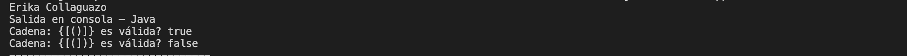
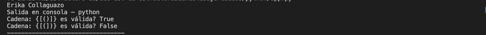
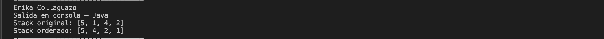
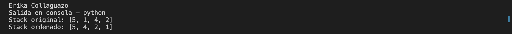
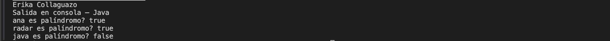
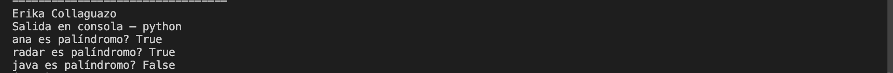

# Estructuras de Datos – Lineales

**Estudiante:** Erika Collaguazo  
**Asignatura:** Estructura de Datos  
**Práctica:** Estructuras de Datos Lineales  
**Lenguajes:** Java y Python  
**Correo Institucional:** ecollaguazom@est.ups.edu.ec

---

## Práctica – Estructuras de Datos Lineales

La presente práctica tiene como objetivo reforzar el uso de **estructuras de datos lineales** como **Stack (Pila)** y **Queue (Cola)**, aplicando su comportamiento característico (LIFO y FIFO) para la resolución de problemas algorítmicos.

La práctica consta de **tres ejercicios**, implementados tanto en **Java** como en **Python**, respetando las restricciones indicadas.

---

## Ejercicio 01 – Validación de Signos

### Descripción
Se implementa un algoritmo que determina si una cadena de texto que contiene únicamente los caracteres: ( ) { } [ ] está correctamente balanceada.

### Condiciones
- Todo símbolo de apertura debe cerrarse.
- Los símbolos deben cerrarse en el orden correcto.
- Cada símbolo de cierre debe corresponder a su tipo de apertura.

### Estructura utilizada
- **Stack (Pila)**

### Lógica aplicada
- Se recorren los caracteres del String.
- Los símbolos de apertura se almacenan en la pila.
- Al encontrar un símbolo de cierre, se valida que coincida con el último símbolo de apertura.
- Al final, la pila debe quedar vacía para que la cadena sea válida.

### Ejemplos

**Input:** `{[()]}`  
**Output:** `true`

**Input:** `{[(])}`  
**Output:** `false`

### Salida en consola – Java

### Salida en consola – Python

---

## Ejercicio 02 – Ordenar un Stack

### Descripción
Se implementa un algoritmo que ordena un **Stack de enteros** de manera que el **elemento más pequeño quede en el tope**.

### Restricciones
- Solo se permite el uso de Stacks adicionales.
- No se permite el uso de arreglos u otras estructuras.
- El ordenamiento se realiza únicamente con:
  - `push`
  - `pop`
  - `peek`
  - `isEmpty`

### Estructura utilizada
- **Stack (Pila)**

### Lógica aplicada
- Se utiliza un stack auxiliar.
- Se insertan los elementos en orden utilizando comparaciones con el tope.
- Al finalizar, el stack original queda ordenado.

### Ejemplo

**Input (tope):**
5 → 1 → 4 → 2
**Output (tope):**
1 → 2 → 4 → 5

### Salida en consola – Java

### Salida en consola – Python

---

## Ejercicio 03 – Palíndromo usando Colas

### Descripción
Se implementa un algoritmo que determina si una palabra es un **palíndromo**, utilizando únicamente **colas (Queue)**.

### Condiciones
- No se compara directamente el String.
- Se utilizan dos colas y una cola auxiliar.
- Se aprovecha el comportamiento FIFO.

### Estructura utilizada
- **Queue (Cola)**

### Lógica aplicada
- Se insertan los caracteres en una cola original.
- Se invierte el orden usando una cola auxiliar.
- Se comparan ambas colas carácter por carácter.

### Ejemplos

| Entrada | Salida |
|------|------|
| ana | true |
| radar | true |
| java | false |

### Salida en consola – Java

### Salida en consola – Python

---

## Conclusiones

- El uso de **Stacks** permite resolver problemas relacionados con validación y ordenamiento gracias a su comportamiento LIFO.
- Las **Queues** son ideales para comparar secuencias de forma ordenada usando FIFO.
- La práctica permitió reforzar el razonamiento lógico y el dominio de estructuras de datos lineales.
- Implementar los mismos algoritmos en Java y Python facilita la comprensión de las estructuras independientemente del lenguaje.

---